# NUSphere Social Media App
## Proposed Level of Achievement: Apollo 11
## Website Link: https://nusphere-seven.vercel.app/ 
NUSphere is a campus-centric social media platform designed specifically for NUS students to share posts, connect with friends, and engage with university life in a more focused environment. It brings together everyday student experiences such as modules, CCAs, residences, study spots, and events into one space, making it easier for students to interact around shared academic and social contexts.

## Motivation
In NUS, it can be hard to meet new people outside existing circles like coursemates or hall friends, even though opportunities exist. There is no dedicated platform for students to connect based on shared interests, modules, or lifestyles, so many potential friendships and study opportunities are missed.

## Aim
We hope to create a social platform tailored specifically for NUS students that helps them connect with others in a more meaningful and natural way.  

The system will not only allow users to post and interact like a normal social media app,
but also recommend people that they are compatible with based on their profile,
interests, and lifestyle. We also aim to make it easier for students to organize and join
social events.

## Features
### Feature 1: User Feed (Core Feature)
Users can create profiles including fields such as major, year, residence, and nationality. Additionally, users can send friend requests with each other and become friends.
### Feature 2: Social Feed (Core Feature)
Users can create posts, like, and comment, similar to a normal social media platform. The feed will be based on their friend's posts and trending posts happening around campus.
### Feature 3: Discover People (Core Feature)
Users can discover new people to be friends with based on fields such as faculty, residence, year, major, and nationality. Users will also get recommendations of people that has similarities on such fields.
### Feature 4: Event Creation and Joining (Core Feature)
Users can create events (e.g. study sessions, gym, meals) and others can join them.
### Feature 5: Chat (Extension Feature)
Users can send direct messages to other students to communicate privately, discuss modules, make plans, or build connections in a more personal and real-time way.
### Feature 6: Marketplace (Extension Feature)
Users can create listings for new or used everyday university items on the marketplace, where other users can browse and purchase them.
### Feature 7: Module Thread (Extension Feature)
Users can join dedicated discussion spaces for each module to ask questions, share notes, and discuss lectures, tutorials, and exams with others taking the same course.

## Timeline
Final UI/UX Polishing and proper backend logic refurnishing will be done before Splashdown.

## Tech Stack
1. Frontend: Next.js/React deployed with Vercel
2. Backend: Express.js deployed with Render
3. Database: PostgreSQL deployed with Neon and Cloudflare R2 for storing images

## Software Architecture
### Hosting Architecture

This diagram specifies the platforms used to host NUSphere.  
During production, frontend is hosted in Vercel, backend in Render, database in Neon, and image storing in an R2 bucket owned by Cloudflare. 

 
During development, both frontend and backend is hosted locally in two different ports (3000 and 4000 respectively). However, this environment still shares the same cloud-based database used in production for both PostgreSQL and R2.

### Request Flow Architecture

This diagram illustrates how requests are made to the backend server within NUSphere. In Next.js, components can run either on the server (**Server Components**) or in the user's browser (**Client Components**). Requests originating from Server Components are sent directly to the Express.js backend, as they execute on the server itself.

In contrast, requests from Client Components are first routed through a proxy layer implemented within the Next.js application before being forwarded to the backend. As a result, Client Components **do not communicate directly** with the Express.js server. This architecture follows the **Backend for Frontend (BFF)** pattern and was adopted to address authentication and cookie-handling challenges, which are explained in the following diagram.


### Authentication Flow Architecture

This diagram illustrates the authentication flow used by NUSphere, where a JWT token is issued as a cookie upon successful login. For all subsequent requests, the browser automatically includes this cookie, allowing the backend to identify and authenticate the user without requiring them to log in again.

However, the backend cannot directly issue a cookie to the browser in our production setup because the frontend and backend are hosted on different domains (`.vercel.app` and `.onrender.com`). Due to browser security policies, cookies issued by the backend domain cannot be reliably stored and sent by the browser when interacting with the frontend domain.

A common solution is to use a custom domain shared by both services. As an alternative, NUSphere adopts the **Backend for Frontend (BFF)** pattern. In this architecture, all requests from the browser and responses from the backend are routed through a proxy layer hosted within the Next.js frontend application (as explained in the previous diagram: [Request Flow Architecture](#request-flow-architecture)). Since the cookie is ultimately issued by the frontend domain (`.vercel.app`), the browser can store it correctly and automatically include it in future requests, enabling secure cookie-based authentication across the application.

### Database Schema

As for the database, NUSphere uses a PostgreSQL relational database as typically found in most social media apps such as Instagram.

### Git Branching Strategy

NUSphere follows a `Feature Branching Strategy`, where each new feature or bug fix is developed in a separate branch. This allows multiple team members to work independently without affecting the stability of the main branch. Once a feature is completed and tested, it is merged back into main through a pull request. This exact pattern depicted in the diagram is implemented in both the frontend and the backend repository.

## Mockup
### Home Page
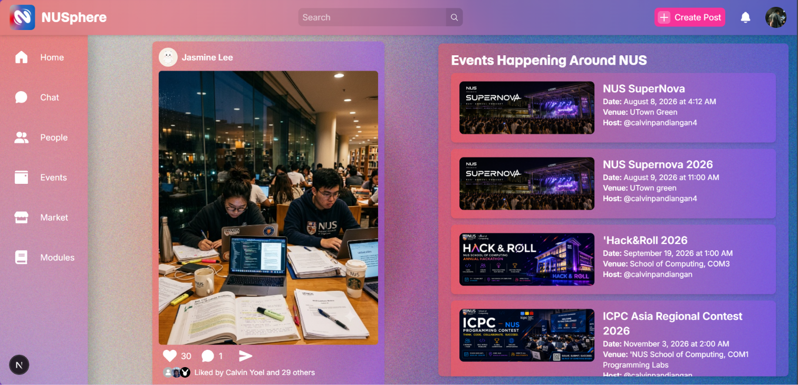
### Profile Page
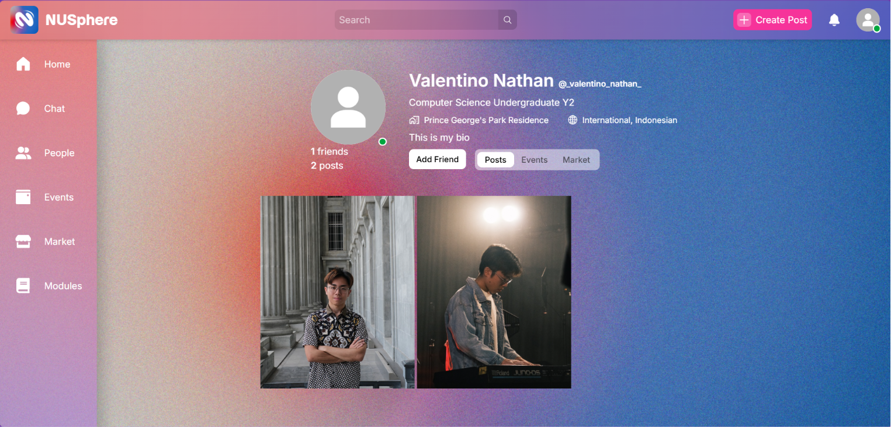
### Post Page
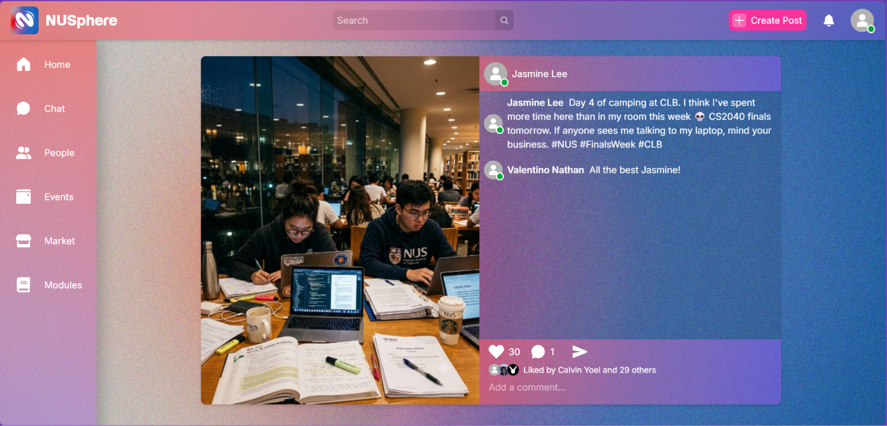
### People Page
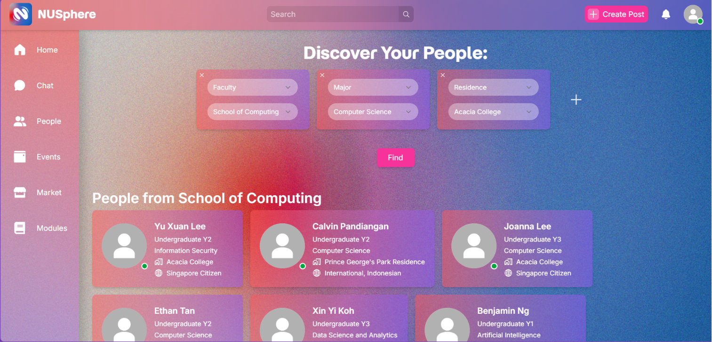
### Create Post Page
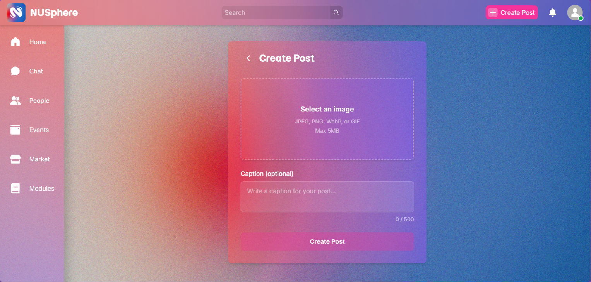
### Login Page

### SignUp Page
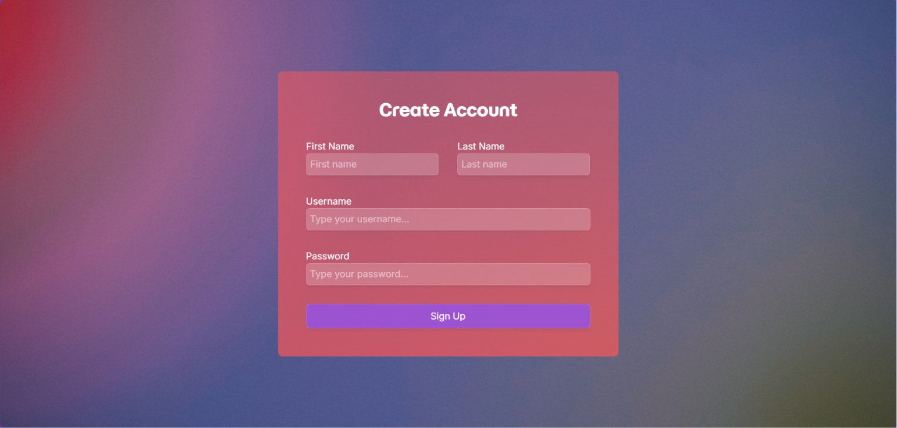
### Account Form Page
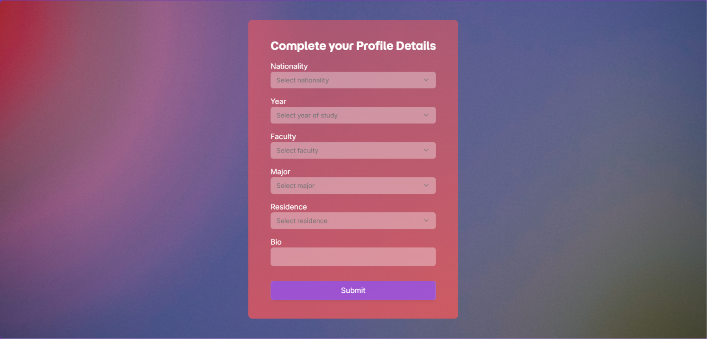
### Event Page
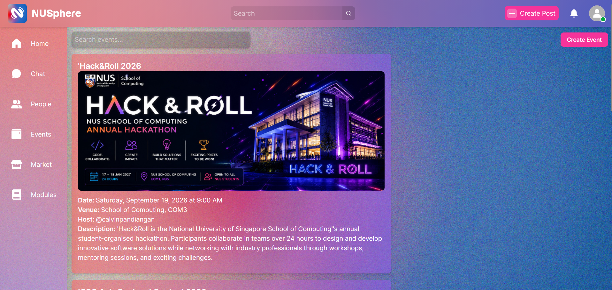
### Create Event Page
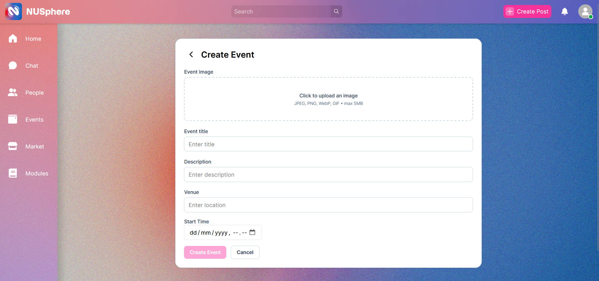
### Event Attendance
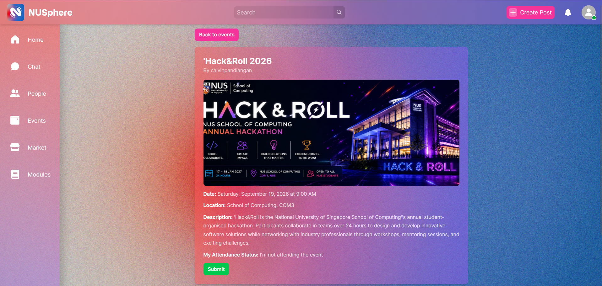
## Modules Page
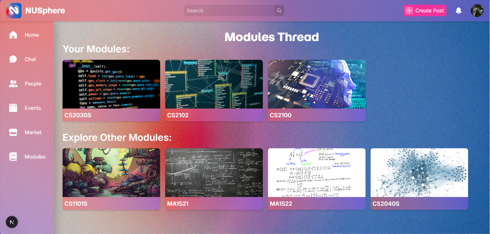
## Modules Thread Page
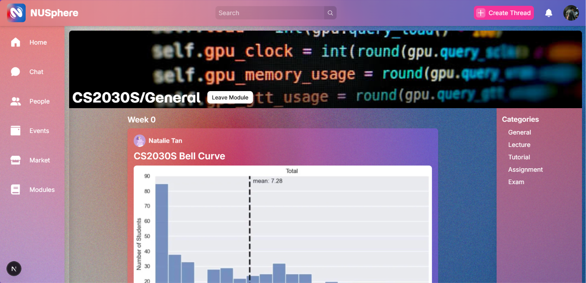
## Thread Reply
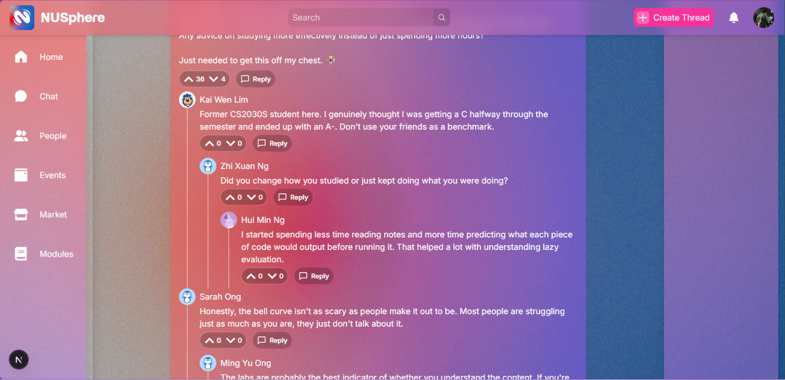
## Create Thread
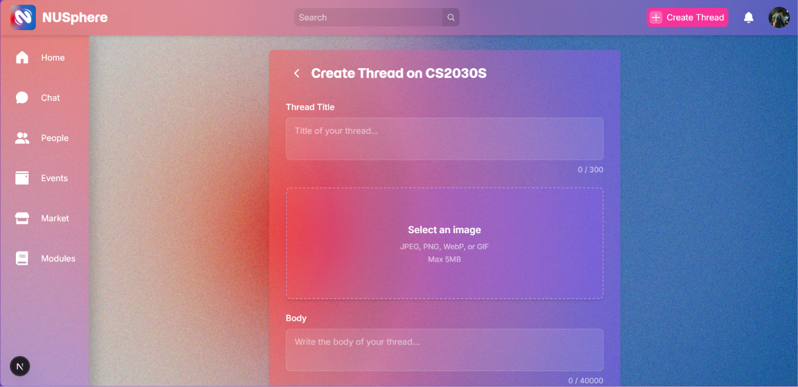
## Marketplace
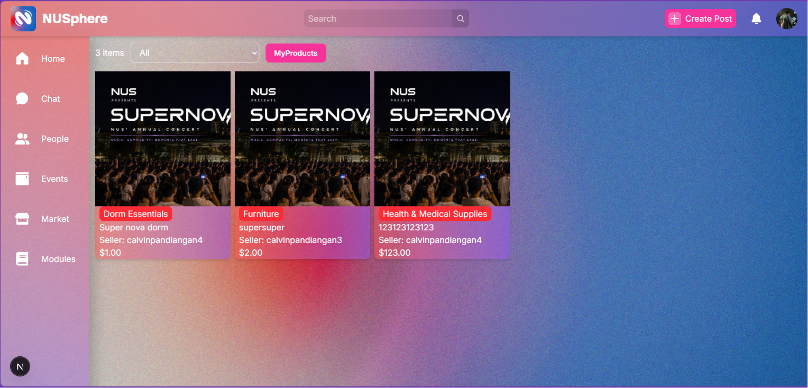
## Market Product
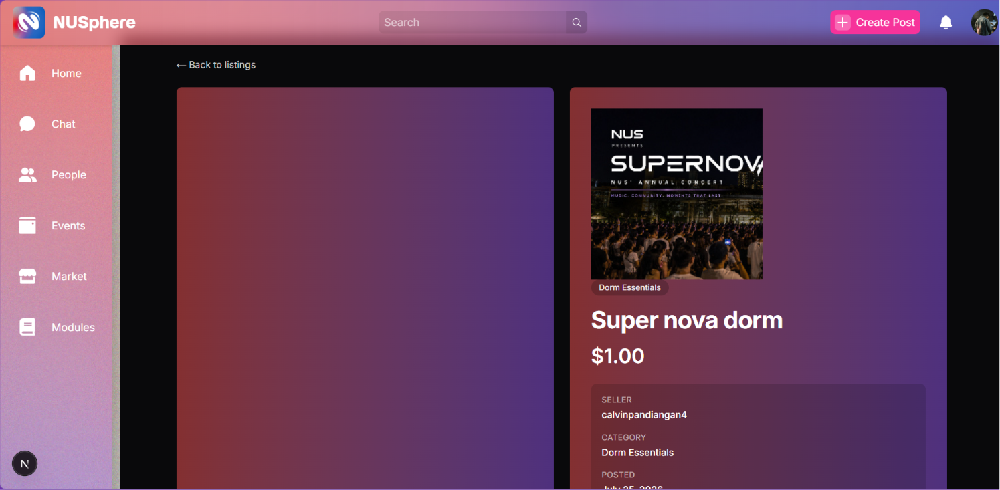
<br>
<br>
# NUSphere Backend

## Folder structure

```text
src/
  app.js                 # Express app setup and route mounting
  server.js              # Application entry point
  controllers/           # Request handlers for each feature
  middleware/            # Validation and auth middleware
  routes/                # API route definitions
  services/              # Business logic for each feature
  db/                    # Database connection setup
  utils/                 # Shared helper functions
  socket/                # Socket.IO-related code
tests/                   # Test files and test helpers
```

## API documentation

All protected endpoints require a valid authentication token in the request cookie unless noted otherwise.

### Authentication
- POST /auth/login: Log in a user with a username and password.
- POST /auth/signup/create-account: Create a new account.
- POST /auth/signup/edit-account-details: Save additional profile details for the authenticated user.

### Users
- GET /users/username/:username: Get a user profile by username.
- GET /users/id/:userId: Get a user profile by user ID.
- GET /users: Search or query users.

### Posts
- POST /posts: Create a new post with an image and optional caption.
- GET /posts/feed: Get the feed of posts for the authenticated user.
- GET /posts/username/:username: Get posts created by a specific username.
- GET /posts/id/:userId: Get posts created by a specific user ID.
- GET /posts/:postId: Get details for one post.
- POST /posts/:postId/likes: Like a post.
- GET /posts/:postId/likes: Check whether the current user liked a post.

### Comments
- GET /comments/:postId: Get comments for a specific post.
- POST /comments/:postId: Add a comment to a post.

### Events
- POST /events: Create a new event with image and event details.
- GET /events: Get a list of events.
- GET /events/:id: Get details for one event.

### Event attendance
- GET /events/:id/attendance: Get attendance info for an event.
- POST /events/:id/attendance: Register the current user for an event.
- DELETE /events/:id/attendance: Remove the current user from an event.

### Friend requests
- GET /friend-requests: Get incoming friend requests.
- DELETE /friend-requests/:senderId: Reject or remove a friend request.
- POST /friend-requests/:receiverId: Send, accept, or manage a friend request.
- GET /friend-requests/:receiverId: Check the current friend request status with a user.

### Conversations
- POST /conversations: Create or retrieve a conversation between users.

### Modules
- GET /modules/my: Get modules for the current user.
- GET /modules/feed: Get module feed content.
- GET /modules/:moduleCode: Get module information.
- GET /modules/:moduleCode/threads: Get discussion threads for a module.
- POST /modules/:moduleCode/threads: Create a thread in a module.
- POST /modules/:moduleCode/threads/:threadId/replies: Add a reply to a thread.
- GET /modules/:moduleCode/threads/:threadId/replies: Get replies for a thread.
- POST /modules/:moduleCode/threads/:threadId/upvote: Upvote a thread.
- POST /modules/:moduleCode/threads/:threadId/downvote: Downvote a thread.
- DELETE /modules/:moduleCode/threads/:threadId/upvote: Remove an upvote.
- DELETE /modules/:moduleCode/threads/:threadId/downvote: Remove a downvote.
- POST /modules/:moduleCode/threads/:threadId/replies/:replyId/upvote: Upvote a reply.
- DELETE /modules/:moduleCode/threads/:threadId/replies/:replyId/upvote: Remove a reply upvote.
- POST /modules/:moduleCode/threads/:threadId/replies/:replyId/downvote: Downvote a reply.
- DELETE /modules/:moduleCode/threads/:threadId/replies/:replyId/downvote: Remove a reply downvote.
- POST /modules/:moduleCode/attendance: Mark attendance for a module.
- GET /modules/:moduleCode/attendance: Get attendance for a module.
- DELETE /modules/:moduleCode/attendance: Remove attendance for a module.

## Database Documentation

### Table: categories
This table stores category labels that can be assigned to marketplace listings. It provides a simple reference list that supports the listings domain and helps keep category values consistent.

### Table: comments
This table stores comments made on posts. It links user-generated discussion content to both the relevant post and the commenting user.

### Table: conversation_members
This table records which users belong to each conversation and their membership role. It supports multi-user conversation membership rather than storing members only as a pair of participants.

### Table: conversations
This table stores direct conversations between two users. It defines the basic relationship between participants and prevents duplicate one-to-one conversation records.

### Table: events
This table stores event information created by users. It acts as the main record for an event and holds metadata such as title, description, location, timing, and a public URL.

### Table: events_attendance
This table records which users are attending which events. It is a join table that connects users to events in a many-to-many relationship.

### Table: friend_requests
This table stores potential friendship requests between users. It captures the sender, receiver, and the time the request was created.

### Table: friends
This table stores confirmed friendships between users. It uses a constrained pair representation so each friendship is recorded only once in a canonical order.

### Table: likes
This table records which users have liked which posts. It is a join table that captures the user-post interaction for likes.

### Table: listings
This table stores marketplace listings offered by sellers. It contains listing metadata and a status field that can be used to track whether an item is available, reserved, sold, or cancelled.

### Table: market_conversations
This table links marketplace conversations to specific listings. It helps model the relationship between a conversation and the listing being discussed within that conversation.

### Table: messages
This table stores individual messages sent inside conversations. It contains the message body, sender, and metadata needed to reconstruct conversation history.

### Table: modules
This table stores module records that group discussion threads and attendance. It provides a stable identifier and title for each module entry.

### Table: modules_attendance
This table records which users are attending which modules. It is a many-to-many association table between users and modules.

### Table: posts
This table stores posts created by users. It holds a media URL, caption, and counters that appear to track likes and comments attached to the post.

### Table: replies
This table stores replies made within discussion threads. It supports nested replies by allowing a reply to reference another reply, while also relating each reply to a user, module, and thread.

### Table: reply_downvote
This table records when a user downvotes a reply. It is a join table that links users to the replies they have downvoted.

### Table: reply_upvote
This table records when a user upvotes a reply. It is a join table that links users to the replies they have upvoted.

### Table: reservation_requests
This table records buyer requests for a listing and associates those requests with a conversation. It provides a workflow state for marketplace reservation requests.

### Table: reservations
This table represents active or historical reservations created from reservation requests. It tracks the reservation lifecycle and expiry time for a listing transaction.

### Table: test
This table appears to be a minimal placeholder table with no relationships or additional constraints. Its purpose is not defined beyond the schema itself.

### Table: thread_upvote
This table records when a user upvotes a discussion thread. It is a join table that links users to threads they upvoted.

### Table: threads
This table stores discussion threads within modules. It holds the thread content and supporting metadata such as category, week, and vote counters.

### Table: users
This table stores core user account information, including profile fields and authentication-related values. It forms the central entity for many of the other tables in the schema.

## Testing
### Integration Testing (Jest + Supertest)

#### Overview

This test suite exercises the Express application through real HTTP requests using Supertest. The tests target the actual route, middleware, controller, database, and response flow without starting a real network server.

#### Test strategy

- Each test uses the Express app directly via Supertest.
- The suite uses the dedicated test database connection from TEST_DATABASE_URL.
- The database is reset before each test to keep the suite isolated and deterministic.
- The tests verify both the HTTP response and the database state after each request.

#### Covered areas

| Area | Endpoint(s) | What is tested |
| --- | --- | --- |
| Authentication | POST /auth/login, POST /auth/signup/create-account | Successful login, unknown-user failure, malformed request handling, DB persistence for account creation |
| Users | GET /users/:id, GET /users/username/:username | Authentication enforcement, successful profile lookup |
| Posts | POST /posts | Successful post creation, invalid input without image |
| Comments | POST /comments/:postId | Successful comment creation, missing comment validation |
| Events | POST /events | Successful event creation, missing required fields |
| Friend requests | POST /friend-requests/:receiverId | Successful request creation, invalid action handling |
| Modules | POST /modules/:moduleCode/attendance | Successful attendance tracking, unknown module failure |

#### Current status

The suite was executed successfully against the test database.

| Test file | Status |
| --- | --- |
| tests/auth.api.test.js | Passing |
| tests/user.api.test.js | Passing |
| tests/post.api.test.js | Passing |
| tests/comment.api.test.js | Passing |
| tests/event.api.test.js | Passing |
| tests/friend.api.test.js | Passing |
| tests/module.api.test.js | Passing |

Test Suites: 7 passed, 7 total
Tests:       16 passed, 16 total
Snapshots:   0 total
Time:        12.932 s


### Unit Testing
For unit testing, Vitest was used to verify the business logic implemented in the backend. The test cases focused on validating individual service-layer functions in isolation by mocking database interactions, ensuring that the core application logic behaved correctly under both normal and exceptional conditions. 

A total of 82 unit tests were executed across 31 test suites, with all tests passing successfully. These tests covered key backend functionalities, including user authentication, event management, conversations, comments, posts, friend requests, and user services.

#### Summary

| Metric | Result |
|--------|--------|
| Test Suites | 31 / 31 Passed |
| Tests | 82 / 82 Passed |
| Failed Tests | 0 |

---

#### auth.service.test.js

| Test Case | Status | Duration |
|-----------|--------|----------|
| auth.service > validateUser > throws when username is not found | ✅ Pass | 5 ms |
| auth.service > validateUser > throws when password does not match | ✅ Pass | 1 ms |
| auth.service > validateUser > returns a token when credentials are valid | ✅ Pass | 4 ms |
| auth.service > createAccount > throws when username is already used | ✅ Pass | 1 ms |
| auth.service > createAccount > throws when user insert does not succeed | ✅ Pass | 1 ms |
| auth.service > createAccount > returns a token after successfully creating a new account | ✅ Pass | 1 ms |
| auth.service > editAccountDetails > throws when update does not affect exactly one row | ✅ Pass | 1 ms |
| auth.service > editAccountDetails > succeeds when update affects one row | ✅ Pass | 1 ms |

---

#### comment.service.test.js

| Test Case | Status | Duration |
|-----------|--------|----------|
| comment.service > getCommentByPostId > throws when post does not exist | ✅ Pass | 6 ms |
| comment.service > getCommentByPostId > returns comments and count when post exists | ✅ Pass | 2 ms |
| comment.service > postCommentByPostId > throws when post does not exist | ✅ Pass | 1 ms |
| comment.service > postCommentByPostId > throws when comment insert fails | ✅ Pass | 1 ms |
| comment.service > postCommentByPostId > throws when comment count increment fails and rolls back | ✅ Pass | 2 ms |
| comment.service > postCommentByPostId > returns the created comment with user name data | ✅ Pass | 1 ms |

---

#### conversation.service.test.js

| Test Case | Status | Duration |
|-----------|--------|----------|
| conversation.service > throws when sender or receiver is invalid | ✅ Pass | 5 ms |
| conversation.service > throws when sender and receiver are the same | ✅ Pass | 1 ms |
| conversation.service > throws when receiver does not exist | ✅ Pass | 5 ms |
| conversation.service > returns an existing conversation when one already exists | ✅ Pass | 2 ms |
| conversation.service > returns a conversation and message list when creating a conversation with initial message | ✅ Pass | 2 ms |
| conversation.service > returns conversation rows for getConversationsByUserId | ✅ Pass | 1 ms |
| conversation.service > throws when getMessagesByConversation access is denied | ✅ Pass | 1 ms |
| conversation.service > returns messages when getMessagesByConversation succeeds | ✅ Pass | 1 ms |
| conversation.service > throws when createMessage access is denied | ✅ Pass | 1 ms |
| conversation.service > creates a message when user is in the conversation | ✅ Pass | 1 ms |
| conversation.service > returns true when user is in a conversation | ✅ Pass | 1 ms |
| conversation.service > returns false when user is not in a conversation | ✅ Pass | 0 ms |

---

#### event.attendance.service.test.js

| Test Case | Status | Duration |
|-----------|--------|----------|
| event.attendance.service > returns attendance info when event exists | ✅ Pass | 4 ms |
| event.attendance.service > throws when createEventAttendance user does not exist | ✅ Pass | 2 ms |
| event.attendance.service > throws when createEventAttendance event does not exist | ✅ Pass | 0 ms |
| event.attendance.service > throws when createEventAttendance is duplicated | ✅ Pass | 1 ms |
| event.attendance.service > succeeds when createEventAttendance inserts a row | ✅ Pass | 1 ms |
| event.attendance.service > throws when deleteEventAttendance user does not exist | ✅ Pass | 1 ms |
| event.attendance.service > throws when deleteEventAttendance event does not exist | ✅ Pass | 0 ms |
| event.attendance.service > throws when deleteEventAttendance is not found | ✅ Pass | 0 ms |
| event.attendance.service > succeeds when deleteEventAttendance removes the event attendance | ✅ Pass | 0 ms |

---

#### event.service.test.js

| Test Case | Status | Duration |
|-----------|--------|----------|
| event.service > returns event rows from getEvent | ✅ Pass | 4 ms |
| event.service > returns a single event from getIndividualEvent | ✅ Pass | 1 ms |
| event.service > throws when createEvent does not insert a row | ✅ Pass | 2 ms |
| event.service > succeeds when createEvent inserts a row | ✅ Pass | 1 ms |

---

#### friendRequests.services.test.js

| Test Case | Status | Duration |
|-----------|--------|----------|
| friendRequests.services > friendRequest > throws when receiver does not exist | ✅ Pass | 6 ms |
| friendRequests.services > friendRequest > throws when trying to friend yourself | ✅ Pass | 1 ms |
| friendRequests.services > friendRequest > returns isFriend when friendship already exists | ✅ Pass | 2 ms |
| friendRequests.services > friendRequest > creates a friend request when none exists | ✅ Pass | 1 ms |
| friendRequests.services > unfriendRequest > throws when receiver does not exist | ✅ Pass | 1 ms |
| friendRequests.services > unfriendRequest > returns isNotFriend when no existing friendship exists | ✅ Pass | 0 ms |
| friendRequests.services > unsendFriendRequest > throws when receiver does not exist | ✅ Pass | 1 ms |
| friendRequests.services > unsendFriendRequest > throws when sender and receiver are the same | ✅ Pass | 1 ms |
| friendRequests.services > unsendFriendRequest > returns isNotFriend when deletion succeeds | ✅ Pass | 1 ms |
| friendRequests.services > rejectFriendRequest > throws when sender does not exist | ✅ Pass | 1 ms |
| friendRequests.services > rejectFriendRequest > throws when rejecting your own request | ✅ Pass | 1 ms |
| friendRequests.services > rejectFriendRequest > returns Rejected when request exists | ✅ Pass | 0 ms |
| friendRequests.services > friendRequestStatus > returns sameAccount when sender and receiver are the same | ✅ Pass | 1 ms |
| friendRequests.services > friendRequestStatus > returns isFriend when users are already friends | ✅ Pass | 0 ms |
| friendRequests.services > friendRequestStatus > returns hasBeenRequested when the receiver already sent a request | ✅ Pass | 0 ms |
| friendRequests.services > friendRequestStatus > returns requestSuccess when the sender already sent a request | ✅ Pass | 0 ms |
| friendRequests.services > friendRequestStatus > throws if receiver does not exist | ✅ Pass | 1 ms |
| friendRequests.services > getAllIncomingFriendRequests > returns incoming requests | ✅ Pass | 0 ms |

---

#### post.service.test.js

| Test Case | Status | Duration |
|-----------|--------|----------|
| post.service > throws when getPostsByUserId user does not exist | ✅ Pass | 7 ms |
| post.service > returns posts when getPostsByUserId succeeds | ✅ Pass | 2 ms |
| post.service > throws when getPostsByUsername does not exist | ✅ Pass | 1 ms |
| post.service > returns posts when getPostsByUsername succeeds | ✅ Pass | 1 ms |
| post.service > throws when getPostById is not found | ✅ Pass | 1 ms |
| post.service > returns a post when getPostById succeeds | ✅ Pass | 0 ms |
| post.service > throws when likePostById receives invalid post | ✅ Pass | 1 ms |
| post.service > likes a post successfully | ✅ Pass | 1 ms |
| post.service > throws when unlikePostById receives invalid post | ✅ Pass | 1 ms |
| post.service > unlikes a post successfully | ✅ Pass | 1 ms |
| post.service > returns false when hasLiked is false | ✅ Pass | 1 ms |
| post.service > returns true when hasLiked is true | ✅ Pass | 0 ms |
| post.service > creates a post successfully | ✅ Pass | 0 ms |
| post.service > throws when updateNewPostUser receives invalid user | ✅ Pass | 1 ms |
| post.service > succeeds updateNewPostUser for valid user | ✅ Pass | 0 ms |
| post.service > returns feed results for page 2 | ✅ Pass | 1 ms |
| post.service > returns feed results for page 1 and prepends new post when available | ✅ Pass | 0 ms |

---

#### user.service.test.js

| Test Case | Status | Duration |
|-----------|--------|----------|
| user.service > getUserDetailsByUsername > throws when username is not found | ✅ Pass | 5 ms |
| user.service > getUserDetailsByUsername > returns user details when found | ✅ Pass | 1 ms |
| user.service > getUserDetailsByUserId > throws when user id is not found | ✅ Pass | 1 ms |
| user.service > getUserDetailsByUserId > returns user details when found | ✅ Pass | 1 ms |
| user.service > processQueryUserToDbQuery > builds a strict query for one filter | ✅ Pass | 1 ms |
| user.service > processQueryUserToDbQuery > builds a non-strict query with multiple filters | ✅ Pass | 0 ms |
| user.service > processQueryUserToDbQuery > ignores empty and undefined query values | ✅ Pass | 0 ms |
| user.service > getUserByQuery > adds limit and offset and returns query results | ✅ Pass | 1 ms |

---
